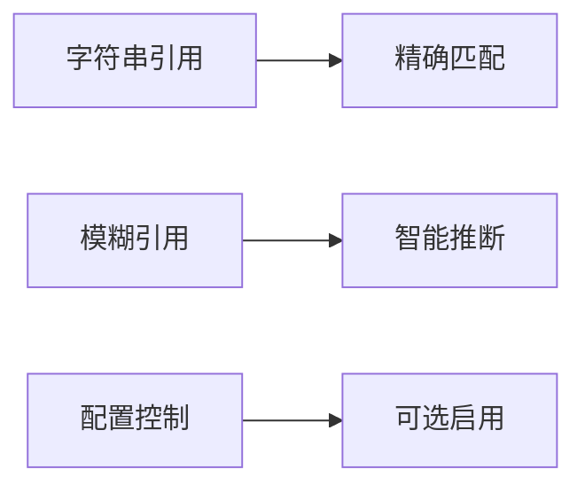

<div align="center">

# 🚀 EmmyLua 语言服务器特性指南

*全面了解 EmmyLua Analyzer Rust 的强大功能*

[](../../README.md)

</div>

---

## 📋 目录

- [🎯 智能补全](#-智能补全)
- [💡 代码提示](#-代码提示)  
- [🔍 代码检查](#-代码检查)
- [📊 代码导航](#-代码导航)
- [🔄 重构功能](#-重构功能)
- [🎨 代码美化](#-代码美化)
- [🔗 链接功能](#-链接功能)
- [✨ 视觉增强](#-视觉增强)

---

## 🎯 智能补全

EmmyLua 提供了业界领先的智能代码补全功能，不仅支持基础的函数、变量、表字段、模块补全，更包含多项创新特性。

### 🔧 核心补全功能

<table>
<tr>
<td width="50%">

#### 🚀 **Auto Require**
- 🎯 智能列出可用的 Lua 模块
- ⚡ 按下 Tab 自动添加 require 语句
- 📍 智能插入到文件顶部合适位置

</td>
<td width="50%">

#### 🏷️ **Alias & Enum**
- 🔍 根据参数类型智能补全
- 📝 支持 alias 和 enum 字段
- 🎯 上下文感知的精确补全

</td>
</tr>
<tr>
<td width="50%">

#### ⚡ **Function Lambda**
- 🔧 检测函数类型参数
- 📋 自动生成 lambda 表达式
- 🎨 保持代码简洁优雅

</td>
<td width="50%">

#### 🏗️ **Namespace**
- 🗂️ 支持命名空间补全
- 🔍 子空间和类名智能提示
- 📖 使用 `---@type namespace<"类名">`

</td>
</tr>
</table>

### 🛣️ 路径补全系统

| 功能 | 描述 | 示例 |
|------|------|------|
| **📁 Module Path** | require 参数智能补全，支持 `.` 和 `/` 分隔符 | `require("utils.string")` |
| **💾 File System** | 检测路径字符串，提供文件系统补全 | `"./config/settings.lua"` |

### 🎪 高级补全特性

- **🔧 Postfix**: 变量后输入 `@` 或 `.` 触发表达式补全
- **📝 Snippet**: 内置代码片段，未来支持自定义模板系统

> **💡 提示**: 所有补全功能都支持模糊匹配和智能排序，让您的编码体验更加流畅。

---

## 💡 代码提示

智能的鼠标悬浮提示系统，为您提供丰富的上下文信息和代码洞察。

### ✨ 基础提示功能

- 🔍 **变量信息**: 类型、作用域、定义位置
- ⚡ **函数签名**: 参数类型、返回值、文档注释
- 📊 **表字段**: 字段类型、访问权限、继承关系
- 📦 **模块信息**: 导出内容、依赖关系、版本信息

### 🚀 高级特性

<div align="center">

#### 🔢 **常量计算**

当变量为常量类型时，悬浮提示将显示：
- ✅ **常量值**: 直接显示变量的实际值
- 🧮 **表达式计算**: 自动计算常量表达式的结果
- 📊 **类型推断**: 显示计算后的精确类型

</div>

```lua
local PI = 3.14159  -- 悬浮显示: local PI: number = 3.14159
local AREA = PI * 2 -- 悬浮显示: local AREA: number = 6.28318
```

> **💡 小贴士**: 常量计算功能支持复杂的数学表达式和字符串操作，帮助您更好地理解代码逻辑。

---

## 🔍 代码检查

基于 EmmyLua 注解的强大静态分析系统，帮助您在编码过程中发现潜在问题并保持代码质量。

### ⚙️ 检查控制

#### 📝 注释控制

<table>
<tr>
<td width="50%">

**文件级别禁用**
```lua
---@diagnostic disable: undefined-global
-- 在整个文件中禁用 undefined-global 检查
```

</td>
<td width="50%">

**单行禁用**
```lua
---@diagnostic disable-next-line: undefined-global
-- 仅在下一行禁用检查
```

</td>
</tr>
</table>

#### ⚙️ 配置文件控制

通过配置文件精细控制检查行为：

```json
{
  "diagnostics": {
    "disable": ["undefined-global", "unused-local"],
    "enable": [],
    "severity": {
      "undefined-global": "error",
      "unused": "warning"
    }
  }
}
```

---

## 📊 代码导航

强大的代码导航系统，让您在大型项目中快速定位和浏览代码。

### 🗂️ 文档符号

<div align="center">

#### 📋 **结构化视图**

在 VS Code 中通过多种方式访问：
- 📊 **OUTLINE 面板**: 左侧边栏结构化视图
- ⌨️ **快捷键**: `Ctrl+Shift+O` 快速打开符号列表
- 🔍 **实时筛选**: 输入关键字快速定位符号

</div>

### 🔍 工作区符号搜索

<table>
<tr>
<td width="50%">

#### 🎯 **全局搜索**
- ⌨️ **快捷键**: `Ctrl+T`
- 🔍 **符号标识**: 输入 `@` + 符号名
- ⚡ **模糊匹配**: 支持部分匹配和缩写

</td>
<td width="50%">

#### 🚀 **智能特性**
- 📊 **结果排序**: 按相关性和使用频率
- 🎯 **类型筛选**: 区分函数、变量、类等
- 📍 **位置预览**: 显示定义位置和上下文

</td>
</tr>
</table>

### 🔗 代码跳转

#### 🎯 跳转到定义

| 方式 | 操作 | 描述 |
|------|------|------|
| **⌨️ 命令** | `Go to Definition` | 标准 LSP 跳转 |
| **👁️ 预览** | `Peek Definition` | 弹窗预览定义 |
| **🖱️ 点击** | `Ctrl + 左键` | 快速跳转 |

### 🔎 引用查找

#### 📍 标准引用查找
- **🔍 查找所有引用**: `Find All References`
- **🖱️ 快速查找**: `Ctrl + 左键`

#### 🚀 增强引用功能

<div align="center">



</div>

- **📝 字符串引用**: 查找字符串字面量的使用位置
- **🎯 模糊引用**: 无定义变量的智能匹配
- **⚙️ 配置控制**: 通过配置文件控制启用状态

> **💡 提示**: 引用查找支持跨文件分析，能够准确识别模块间的依赖关系。

---

## 🔄 重构功能

安全高效的代码重构工具，帮助您在不破坏代码逻辑的前提下优化代码结构。

### 🏷️ 重命名重构

<div align="center">

#### ⌨️ **快捷操作**
- **重命名快捷键**: `F2`
- **智能检测**: 自动识别所有相关引用
- **跨文件支持**: 支持多文件同步重命名

</div>

#### 🛡️ 安全机制

| 特性 | 描述 |
|------|------|
| **🔍 作用域分析** | 精确识别变量作用域，避免误重命名 |
| **📁 跨文件检测** | 检测模块导入导出的重命名影响 |
| **⚠️ 冲突检测** | 提前发现命名冲突并给出建议 |
| **📋 预览功能** | 重命名前预览所有受影响的位置 |

---

## 🎨 代码格式化

基于 [EmmyLuaCodeStyle](https://github.com/CppCXY/EmmyLuaCodeStyle) 的代码格式化系统。

### ✨ 格式化功能

<table>
<tr>
<td width="50%">

#### 📄 **文档格式化**
- ⌨️ **Format Document**: 格式化整个文件
- 🔧 **自动修复**: 修复常见的格式问题
- ⚡ **增量格式化**: 只格式化修改的部分

</td>
<td width="50%">

#### 🎯 **选择格式化**
- ⌨️ **Format Selection**: 格式化选中区域
- 🎨 **样式统一**: 保持代码风格一致
- 📏 **智能缩进**: 自动调整缩进层次

</td>
</tr>
</table>

### 📂 代码折叠

#### 🏗️ **标准折叠**
- 🔧 **函数折叠**: `function ... end`
- 🔀 **控制流折叠**: `if`, `for`, `while` 等
- 📊 **表折叠**: 大型表结构折叠

#### 🎯 **自定义折叠**

```lua
--region 自定义折叠区域
-- 这里是需要折叠的代码
local config = {
    -- 配置项...
}
--endregion
```

> **💡 配置提示**: 详细的格式化配置选项请参考 [EmmyLuaCodeStyle 文档](https://github.com/CppCXY/EmmyLuaCodeStyle/blob/master/README_EN.md)。

---

## 🔗 链接功能

智能识别和处理代码中的各种链接，提升开发效率。

### 🎨 颜色预览

<div align="center">

#### 🌈 **颜色识别**

EmmyLua 智能分析字符串中的颜色值并提供可视化预览

</div>

<table>
<tr>
<td width="50%">

#### 🔍 **支持格式**
- **🎯 十六进制**: `#FF0000`, `#RGBA`
- **📊 6位格式**: `"FF0000"`
- **🌟 8位格式**: `"FF0000FF"`
- **⚡ 自动检测**: 智能识别颜色字符串

</td>
<td width="50%">

#### ✨ **可视化特性**
- **🟥 颜色块**: 代码中直接显示颜色
- **🖱️ 点击编辑**: 点击颜色块打开颜色选择器
- **📋 实时预览**: 修改颜色时实时更新
- **🎨 格式转换**: 支持多种颜色格式转换

</td>
</tr>
</table>

### 📁 文档链接

#### 🔗 **智能路径识别**

```lua
-- 文件路径自动识别为可点击链接
local config_path = "./config/settings.lua"
local image_file = "assets/images/logo.png"
```

#### 🚀 **链接功能**

| 功能 | 描述 | 示例 |
|------|------|------|
| **📂 文件打开** | 点击路径直接打开文件 | `"./utils/helper.lua"` |


---

## ✨ 视觉增强

多层次的视觉增强功能，让代码更加清晰易读。

### 🎨 语义高亮

<div align="center">

#### 🌈 **智能语法着色**

基于 LSP `semanticHighlighting` 标准的高级语法高亮系统

</div>

#### 🎯 **高亮特性**

<table>
<tr>
<td width="50%">

**🔍 Token 分析**
- **📝 变量类型**: 区分局部、全局、参数变量
- **⚡ 函数识别**: 突出显示函数定义和调用
- **📊 关键字**: 智能识别 Lua 关键字
- **🏷️ 注释块**: 特殊处理文档注释

</td>
<td width="50%">

**🎨 视觉区分**
- **🔶 类型标识**: 不同类型使用不同颜色
- **📈 作用域**: 通过颜色深浅区分作用域
- **⚠️ 错误标记**: 错误代码红色高亮
- **💡 建议标记**: 优化建议黄色提示

</td>
</tr>
</table>

### 🖊️ EmmyLua 增强渲染

#### 🎯 **私有协议增强**

通过专有协议实现的高级代码渲染功能：

```lua
local mutable_var = 10    -- 可变变量：下划线标记
local const_value = 42    -- 常量：普通显示
```

#### ✨ **增强功能**

- **📏 可变变量下划线**: 可变的 local 变量自动添加下划线
- **🎨 类型着色**: 根据类型系统进行智能着色
- **⚡ 实时更新**: 代码修改时实时更新渲染效果

### 💡 内联提示 (Inlay Hints)

<div align="center">

#### 📊 **智能提示系统**

在代码中显示有用的类型和状态信息，无需鼠标悬浮

</div>

#### 🔧 **提示类型**

| 提示类型 | 描述 | 示例 |
|----------|------|------|
| **🏷️ 参数类型** | 显示函数参数的类型信息 | `function(name: string)` |
| **📊 变量类型** | 显示变量的推断类型 | `local count: number` |
| **🔄 重写标记** | 标记重写的父类方法 | `override function()` |
| **⚡ 异步调用** | 标记 await 异步调用 | `await coroutine()` |

#### ⚙️ **配置控制**

```json
{
  "inlayHints": {
    "enable": true,
    "paramHint": true,
    "indexHint": true,
    "localHint": false,
    "overrideHint": true
  }
}
```

### 🎯 文档高亮

#### 🔍 **智能高亮功能**

虽然编辑器提供基础高亮，EmmyLua 提供更精确的高亮支持：

<table>
<tr>
<td width="50%">

**📍 引用高亮**
- **🎯 变量引用**: 高亮同一变量的所有使用
- **⚡ 实时跟踪**: 光标移动时实时更新

</td>
<td width="50%">

**🏷️ 关键字组**
- **🔗 配对高亮**: `if-then-end` 配对显示
- **🔄 循环块**: `for-do-end` 结构高亮
- **📊 条件块**: `if-elseif-else-end` 完整高亮

</td>
</tr>
</table>

#### 🌐 **跨编辑器支持**

为其他编辑器提供与 VS Code 同等的高亮体验，确保一致的开发体验。

---

<div align="center">


[⬆ 返回顶部](#-emmylua-语言服务器特性指南)

</div>

