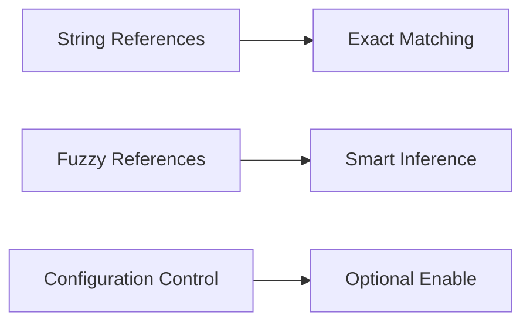

<div align="center">

# 🚀 EmmyLua Language Server Features Guide

[中文文档](./features_CN.md)

*Comprehensive guide to the powerful features of EmmyLua Analyzer Rust*

[](../../README.md)

</div>

---

## 📋 Table of Contents

- [🎯 Smart Completion](#-smart-completion)
- [💡 Code Hints](#-code-hints)  
- [🔍 Code Diagnostics](#-code-diagnostics)
- [📊 Code Navigation](#-code-navigation)
- [🔄 Refactoring](#-refactoring)
- [🎨 Code Formatting](#-code-formatting)
- [🔗 Link Features](#-link-features)
- [✨ Visual Enhancements](#-visual-enhancements)

---

## 🎯 Smart Completion

EmmyLua provides industry-leading intelligent code completion features, supporting not only basic function, variable, table field, and module completion, but also multiple innovative features.

### 🔧 Core Completion Features

<table>
<tr>
<td width="50%">

#### 🚀 **Auto Require**
- 🎯 Intelligently lists available Lua modules
- ⚡ Automatically adds require statement on Tab press
- 📍 Smart insertion at appropriate position in file header

</td>
<td width="50%">

#### 🏷️ **Alias & Enum**
- 🔍 Smart completion based on parameter types
- 📝 Support for alias and enum fields
- 🎯 Context-aware precise completion

</td>
</tr>
<tr>
<td width="50%">

#### ⚡ **Function Lambda**
- 🔧 Detects function type parameters
- 📋 Automatically generates lambda expressions
- 🎨 Keeps code clean and elegant

</td>
<td width="50%">

#### 🏗️ **Namespace**
- 🗂️ Supports namespace completion
- 🔍 Smart suggestions for sub-namespaces and class names
- 📖 Use `---@type namespace<"ClassName">`

</td>
</tr>
</table>

### 🛣️ Path Completion System

| Feature | Description | Example |
|---------|-------------|---------|
| **📁 Module Path** | Smart completion for require parameters, supports `.` and `/` separators | `require("utils.string")` |
| **💾 File System** | Detects path strings, provides file system completion | `"./config/settings.lua"` |

### 🎪 Advanced Completion Features

- **🔧 Postfix**: Type `@` or `.` after variables to trigger expression completion
- **📝 Snippet**: Built-in code snippets, future support for custom template system

> **💡 Tip**: All completion features support fuzzy matching and smart sorting for a smoother coding experience.

---

## 💡 Code Hints

Intelligent mouse hover hint system that provides rich contextual information and code insights.

### ✨ Basic Hint Features

- 🔍 **Variable Information**: Type, scope, definition location
- ⚡ **Function Signatures**: Parameter types, return values, documentation comments
- 📊 **Table Fields**: Field types, access permissions, inheritance relationships
- 📦 **Module Information**: Export content, dependencies, version information

### 🚀 Advanced Features

<div align="center">

#### 🔢 **Constant Calculation**

When variables are constant types, hover hints will display:
- ✅ **Constant Values**: Directly show the actual value of variables
- 🧮 **Expression Calculation**: Automatically calculate constant expression results
- 📊 **Type Inference**: Show precise types after calculation

</div>

```lua
local PI = 3.14159  -- Hover displays: const PI: number = 3.14159
local AREA = PI * 2 -- Hover displays: const AREA: number = 6.28318
```

> **💡 Pro Tip**: Constant calculation supports complex mathematical expressions and string operations, helping you better understand code logic.

---

## 🔍 Code Diagnostics

Powerful static analysis system based on EmmyLua annotations, helping you discover potential issues during coding and maintain code quality.

### ⚙️ Diagnostic Control

#### 📝 Comment Control

<table>
<tr>
<td width="50%">

**File-level Disable**
```lua
---@diagnostic disable: undefined-global
-- Disable undefined-global check in entire file
```

</td>
<td width="50%">

**Single-line Disable**
```lua
---@diagnostic disable-next-line: undefined-global
-- Disable check only for next line
```

</td>
</tr>
</table>

#### ⚙️ Configuration File Control

Fine-tune diagnostic behavior through configuration files:

```json
{
  "diagnostics": {
    "disable": ["undefined-global", "unused"],
    "enable": [],
    "severity": {
      "undefined-global": "error",
      "unused": "warning"
    }
  }
}
```


## 📊 Code Navigation

Powerful code navigation system that allows you to quickly locate and browse code in large projects.

### 🗂️ Document Symbols

<div align="center">

#### 📋 **Structured View**

Access through multiple ways in VS Code:
- 📊 **OUTLINE Panel**: Structured view in left sidebar
- ⌨️ **Shortcut**: `Ctrl+Shift+O` to quickly open symbol list
- 🔍 **Real-time Filtering**: Type keywords to quickly locate symbols

</div>

### 🔍 Workspace Symbol Search

<table>
<tr>
<td width="50%">

#### 🎯 **Global Search**
- ⌨️ **Shortcut**: `Ctrl+T`
- 🔍 **Symbol Prefix**: Type `@` + symbol name
- ⚡ **Fuzzy Matching**: Supports partial matching and abbreviations

</td>
<td width="50%">

#### 🚀 **Smart Features**
- 📊 **Result Sorting**: By relevance and usage frequency
- 🎯 **Type Filtering**: Distinguish functions, variables, classes, etc.
- 📍 **Location Preview**: Show definition location and context

</td>
</tr>
</table>

### 🔗 Code Navigation

#### 🎯 Go to Definition

| Method | Operation | Description |
|--------|-----------|-------------|
| **⌨️ Command** | `Go to Definition` | Standard LSP navigation |
| **👁️ Preview** | `Peek Definition` | Popup preview definition |
| **🖱️ Click** | `Ctrl + Left Click` | Quick navigation |

### 🔎 Find References

#### 📍 Standard Reference Finding
- **🔍 Find All References**: `Find All References`
- **🖱️ Quick Find**: `Ctrl + Left Click`

#### 🚀 Enhanced Reference Features

<div align="center">



</div>

- **📝 String References**: Find usage locations of string literals
- **🎯 Fuzzy References**: Smart matching for undefined variables
- **⚙️ Configuration Control**: Control enable status through configuration files

> **💡 Tip**: Reference finding supports cross-file analysis and can accurately identify dependencies between modules.

---

## 🔄 Refactoring

Safe and efficient code refactoring tools to help you optimize code structure without breaking code logic.

### 🏷️ Rename Refactoring

<div align="center">

#### ⌨️ **Quick Operations**
- **Rename Shortcut**: `F2`
- **Smart Detection**: Automatically identify all related references
- **Cross-file Support**: Support multi-file synchronous renaming

</div>

#### 🛡️ Safety Mechanisms

| Feature | Description |
|---------|-------------|
| **🔍 Scope Analysis** | Precisely identify variable scope to avoid miss-renaming |
| **📁 Cross-file Detection** | Detect renaming impact on module imports/exports |
| **⚠️ Conflict Detection** | Proactively discover naming conflicts and provide suggestions |
| **📋 Preview Feature** | Preview all affected locations before renaming |

---

## 🎨 Code Formatting

Professional code formatting system based on [EmmyLuaCodeStyle](https://github.com/CppCXY/EmmyLuaCodeStyle).

### ✨ Formatting Features

<table>
<tr>
<td width="50%">

#### 📄 **Document Formatting**
- ⌨️ **Format Document**: Format entire file
- 🔧 **Auto Fix**: Fix common formatting issues
- ⚡ **Incremental Formatting**: Only format modified parts

</td>
<td width="50%">

#### 🎯 **Selection Formatting**
- ⌨️ **Format Selection**: Format selected region
- 🎨 **Style Consistency**: Maintain consistent code style
- 📏 **Smart Indentation**: Automatically adjust indentation levels

</td>
</tr>
</table>

### 📂 Code Folding

#### 🏗️ **Standard Folding**
- 🔧 **Function Folding**: `function ... end`
- 🔀 **Control Flow Folding**: `if`, `for`, `while`, etc.
- 📊 **Table Folding**: Large table structure folding

#### 🎯 **Custom Folding**

```lua
--region Custom Folding Region
-- Code to be folded here
local config = {
    -- Configuration items...
}
--endregion
```

> **💡 Configuration Tip**: For detailed formatting configuration options, please refer to [EmmyLuaCodeStyle Documentation](https://github.com/CppCXY/EmmyLuaCodeStyle/blob/master/README_EN.md).

---

## 🔗 Link Features

Intelligently identify and handle various links in code to improve development efficiency.

### 🎨 Color Preview

<div align="center">

#### 🌈 **Color Recognition**

EmmyLua intelligently analyzes color values in strings and provides visual preview

</div>

<table>
<tr>
<td width="50%">

#### 🔍 **Supported Formats**
- **🎯 Hexadecimal**: `#FF0000`, `#RGBA`
- **📊 6-digit Format**: `"FF0000"`
- **🌟 8-digit Format**: `"FF0000FF"`
- **⚡ Auto Detection**: Smart recognition of color strings

</td>
<td width="50%">

#### ✨ **Visual Features**
- **🟥 Color Blocks**: Display colors directly in code
- **🖱️ Click to Edit**: Click color block to open color picker
- **📋 Real-time Preview**: Update in real-time when modifying colors
- **🎨 Format Conversion**: Support multiple color format conversions

</td>
</tr>
</table>

### 📁 Document Links

#### 🔗 **Smart Path Recognition**

```lua
-- File paths automatically recognized as clickable links
local config_path = "./config/settings.lua"
local image_file = "./assets/images/logo.png"
```

#### 🚀 **Link Features**

| Feature | Description | Example |
|---------|-------------|---------|
| **📂 File Opening** | Click path to directly open file | `"./utils/helper.lua"` |
---

## ✨ Visual Enhancements

Multi-level visual enhancement features to make code clearer and more readable.

### 🎨 Semantic Highlighting

<div align="center">

#### 🌈 **Smart Syntax Coloring**

Advanced syntax highlighting system based on LSP `semanticHighlighting` standard

</div>

#### 🎯 **Highlighting Features**

<table>
<tr>
<td width="50%">

**🔍 Token Analysis**
- **📝 Variable Types**: Distinguish local, global, parameter variables
- **⚡ Function Recognition**: Highlight function definitions and calls
- **📊 Keywords**: Smart recognition of Lua keywords
- **🏷️ Comment Blocks**: Special handling of documentation comments

</td>
<td width="50%">

**🎨 Visual Distinction**
- **🔶 Type Identification**: Different types use different colors
- **📈 Scope**: Distinguish scope through color depth
- **⚠️ Error Marking**: Error code highlighted in red
- **💡 Suggestion Marking**: Optimization suggestions in yellow

</td>
</tr>
</table>

### 🖊️ EmmyLua Enhanced Rendering

#### 🎯 **Private Protocol Enhancement**

Advanced code rendering features implemented through proprietary protocols:

```lua
local mutable_var = 10    -- Mutable variable: underlined
local const_value = 42    -- Constant: normal display
```

#### ✨ **Enhancement Features**

- **📏 Mutable Variable Underline**: Automatically underline mutable local variables
- **🎨 Type Coloring**: Smart coloring based on type system
- **⚡ Real-time Updates**: Real-time rendering updates when code is modified

### 💡 Inlay Hints

<div align="center">

#### 📊 **Smart Hint System**

Display useful type and status information in code without mouse hovering

</div>

#### 🔧 **Hint Types**

| Hint Type | Description | Example |
|-----------|-------------|---------|
| **🏷️ Parameter Types** | Show function parameter type information | `function(name: string)` |
| **📊 Variable Types** | Show inferred variable types | `local count: number` |
| **🔄 Override Markers** | Mark overridden parent class methods | `override function()` |
| **⚡ Async Calls** | Mark await async calls | `await coroutine()` |

#### ⚙️ **Configuration Control**

```json
{
  "inlayHints": {
    "enable": true,
    "paramHint": true,
    "indexHint": true,
    "localHint": false,
    "overrideHint": true
  }
}
```

### 🎯 Document Highlighting

#### 🔍 **Smart Highlighting Features**

While editors provide basic highlighting, EmmyLua provides more precise highlighting support:

<table>
<tr>
<td width="50%">

**📍 Reference Highlighting**
- **🎯 Variable References**: Highlight all uses of the same variable
- **🔗 Scope**: Show effective scope of variables
- **⚡ Real-time Tracking**: Real-time updates when cursor moves

</td>
<td width="50%">

**🏷️ Keyword Groups**
- **🔗 Paired Highlighting**: `if-then-end` paired display
- **🔄 Loop Blocks**: `for-do-end` structure highlighting
- **📊 Conditional Blocks**: `if-elseif-else-end` complete highlighting

</td>
</tr>
</table>

#### 🌐 **Cross-Editor Support**

Provide the same highlighting experience as VS Code for other editors, ensuring consistent development experience.

---

<div align="center">

## 🚀 Summary

EmmyLua Analyzer Rust provides comprehensive Lua development support, from smart completion to visual enhancements. Every feature is carefully designed to improve your coding efficiency and code quality.

### 🎯 Core Advantages

- **⚡ High Performance**: Native Rust performance with fast response
- **🧠 Intelligence**: Deep type analysis and inference
- **🎨 Modern**: Rich visual effects and user experience
- **🔧 Configurable**: Flexible configuration options for different needs


[⬆ Back to Top](#-emmylua-language-server-features-guide)

</div>

